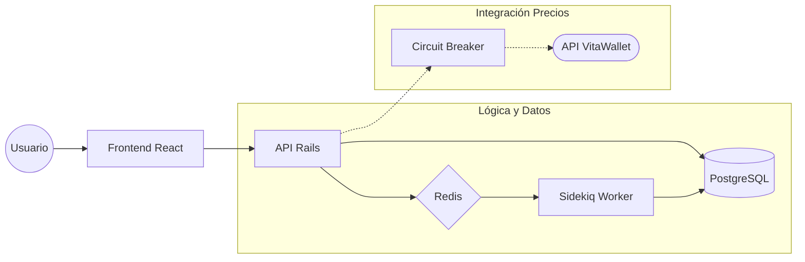

# VitaWallet Exchange — Prueba Técnica

Una mini-aplicación de intercambio de criptomonedas full-stack construida con **Ruby on Rails API** + **React (TypeScript)**, diseñada para demostrar patrones de ingeniería de nivel de producción.

---

## Resumen de la Arquitectura

```
exchange-mock-app/
├── backend/     Rails 7 API-only (PostgreSQL + Redis + Sidekiq)
├── frontend/    React 18 + TypeScript + Vite
├── docs/        Especificación OpenAPI
└── docker-compose.yml
```

## 🏗️ Arquitectura del Sistema



### 🔁 Flujo del Intercambio
1. **Cliente**: El usuario solicita un intercambio (POST).
2. **API**: Valida el saldo y encola la ejecución en **Sidekiq**.
3. **Worker**: Sidekiq procesa el cambio de divisas de forma atómica en la **Base de Datos**.

---

## 💎 Decisiones Técnicas y Razonamiento

Hemos construido esta aplicación priorizando la **seguridad financiera** y la **robustez**. Aquí el porqué de nuestras decisiones clave bajo los requisitos del desafío:

> [!IMPORTANT]
> ### 1. Precisión Financiera: NUMERIC(20,8) + BigDecimal
> **Decisión:** Nunca usamos el tipo `Float`. Todas las columnas monetarias son `NUMERIC(20,8)` y los cálculos se hacen con `BigDecimal`.
> **Por qué:** En finanzas, `0.1 + 0.2` debe ser exactamente `0.3`. Los números de punto flotante (`Float`) causan micro-pérdidas por redondeo binario que, a escala, se traducen en discrepancias graves de dinero real.

> [!TIP]
> ### 2. Experiencia de Usuario: Ejecución Asíncrona (Sidekiq)
> **Decisión:** El intercambio se acepta de inmediato (`202 Accepted`) y se procesa en segundo plano.
> **Por qué:** No hacemos esperar al usuario a que la base de datos complete transacciones pesadas. La respuesta es instantánea. Al "bloquear" la tasa al momento de la creación, protegemos al usuario de la volatilidad del precio durante esos milisegundos de espera.

> [!CAUTION]
> ### 3. Red de Seguridad: Idempotencia y Circuit Breaker
> **Decisión:** Implementamos `Idempotency-Key` en los POST y un corta-fuegos (`Stoplight`) en la API de precios.
> **Por qué:** Si el móvil del usuario pierde conexión justo tras darle a "Intercambiar", el reintento no creará un segundo intercambio por error. Si la API de VitaWallet cae, el Circuit Breaker sirve precios en caché en milisegundos, manteniendo la app operativa.

> [!NOTE]
> ### 4. Integridad de Datos: Bloqueo Optimista
> **Decisión:** Uso de `lock_version` en los balances.
> **Por qué:** Evita el famoso "doble gasto". Si dos procesos intentan debitar de la misma cuenta al mismo tiempo, el bloqueo optimista detecta el conflicto y Sidekiq reintenta la operación de forma segura.

---

## 🛠️ Configuración y Despliegue

### Requisitos Previos
- Docker + Docker Compose instalado.

### Instalación Rápida (Recomendado)

1. **Clonar e Iniciar:**
   ```bash
   cp .env.example .env
   docker compose up
   ```
2. **Preparar la Base de Datos:**
   ```bash
   docker compose exec backend bin/rails db:seed
   ```

| Servicio | URL |
| :--- | :--- |
| **Frontend** | http://localhost:5173 |
| **API Backend** | http://localhost:3000 |
| **Swagger Docs** | http://localhost:3000/api-docs |

---

## 🧪 Estrategia de Pruebas

Hemos blindado el sistema con **111 tests automatizados** para garantizar que cada moneda se mueva siempre al lugar correcto.

- **Backend (92 RSpec)**: Probamos desde las restricciones de integridad en la DB hasta la lógica de "cross-rate" para intercambios entre cualquier moneda (BTC/USDT, USD/BTC, etc).
- **Frontend (19 Vitest)**: Simulamos el flujo completo del usuario, incluyendo validación de saldos en tiempo real y estados de carga.

---

## 🌐 Documentación de la API

La especificación completa **OpenAPI 3.0** está disponible en `docs/openapi.yml`. El sistema soporta intercambios dinámicos entre **CLP, USD, BTC, USDC y USDT** de forma automática.
